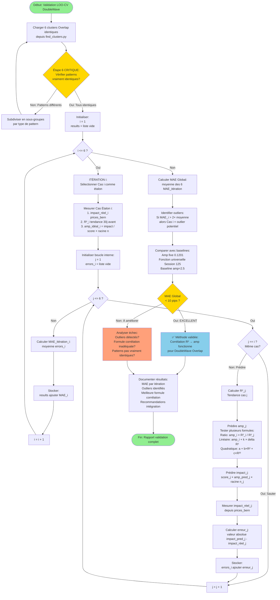

# Flowchart Validation LOO-CV DoubleWave

**Session 132**  
**Date : 13 novembre 2025**

---

## 📊 Diagramme Mermaid

Copie-colle ce code dans **https://mermaid.live** pour visualiser :

---

## 📝 Description du Workflow

### **Étape Critique : Vérification Patterns**
Avant toute calibration, vérifier que les 6 clusters produisent vraiment le même pattern (Single Wave Fort, Double Wave, etc.)

### **Boucle Principale (LOO-CV)**
Pour chaque cas i de 1 à 6 :
1. Sélectionner cas i comme étalon
2. Mesurer impact réel, R², amp idéal pour étalon
3. Pour chaque autre cas j ≠ i :
   - Calculer R²_j
   - Prédire amp_j via corrélation avec étalon
   - Comparer prédiction vs réalité
4. Calculer MAE pour cette itération

### **Résultat Final**
- MAE global = moyenne des 6 itérations
- Détection automatique outliers
- Comparaison avec baselines
- Décision EXCELLENT / À AMÉLIORER

---

## 🎯 Objectif

Valider scientifiquement si la corrélation R² → amplification permet de prédire les cas futurs pour pattern DoubleWave Overlap.

**Critère succès :** MAE global < 10 pips
