# Flowchart COMPLET - Validation DoubleWave avec LOO-CV

**Session 132**  
**Date : 13 novembre 2025**  
**Version : 2.0 - Workflow Complet VALIDÉ**

---

## 📊 Diagramme Mermaid

Copie-colle ce code dans **https://mermaid.live** pour visualiser :

```mermaid
flowchart TD
    Start([Début: Validation DoubleWave Complète]) --> SearchMovements[ÉTAPE 1:<br/>Rechercher mouvements forts<br/>dans prices_bern<br/>Critère: impact > X pips<br/>Période: 3 dernières années]
    
    SearchMovements --> ListMovements[Liste mouvements forts trouvés:<br/>date, heure, impact_pips, direction]
    
    ListMovements --> SelectMovement[Sélectionner 1 mouvement fort<br/>à analyser]
    
    SelectMovement --> IdentifyCluster{ÉTAPE 2:<br/>Identifier cluster events<br/>à cette date/heure?}
    
    IdentifyCluster -->|NON: Pas de cluster| SkipMovement[Laisser tomber ce mouvement<br/>Passer au suivant]
    SkipMovement --> MoreMovements{Autres mouvements<br/>à analyser?}
    
    MoreMovements -->|Oui| SelectMovement
    MoreMovements -->|Non| EndNoData([Fin: Aucun cluster valide trouvé])
    
    IdentifyCluster -->|OUI: Cluster trouvé| DefineSignature[Définir signature cluster:<br/>composition events, pays, scores]
    
    DefineSignature --> SearchIdentical[ÉTAPE 2.1:<br/>Rechercher clusters identiques<br/>dans DB historique<br/>même signature ±5 min]
    
    SearchIdentical --> CountFound{Nombre clusters<br/>identiques trouvés?}
    
    CountFound -->|< 3: Trop peu| SkipMovement
    CountFound -->|>= 3: Suffisant| LoadAllDates[Charger N dates<br/>avec clusters identiques]
    
    LoadAllDates --> VerifyPatterns[ÉTAPE 2.2 CRITIQUE:<br/>Pour CHAQUE date:<br/>Charger prix + mesurer pattern<br/>Single Wave? Double Wave?<br/>Timing peak? Direction?]
    
    VerifyPatterns --> GroupByPattern[ÉTAPE 2.3:<br/>Regrouper dates<br/>par pattern identique]
    
    GroupByPattern --> CheckGroups{Groupes avec<br/>>= 3 dates?}
    
    CheckGroups -->|NON: Tous < 3| SkipMovement
    CheckGroups -->|OUI: Au moins 1 groupe| SelectGroup[Sélectionner groupe<br/>avec pattern identique<br/>N >= 3 dates]
    
    SelectGroup --> InitLOOCV[ÉTAPE 3:<br/>Initialiser LOO-CV<br/>i = 1 à N<br/>results = liste vide]
    
    InitLOOCV --> LoopCheck{i <= N ?}
    
    LoopCheck -->|Non| CalcGlobalMAE[Calculer MAE Global:<br/>moyenne des N MAE_itération]
    
    LoopCheck -->|Oui| SelectEtalon[ITÉRATION i:<br/>Date i = étalon de référence]
    
    SelectEtalon --> MeasureEtalon[Mesurer étalon i:<br/>1. impact_réel_i depuis prices<br/>2. R²_i tendance 30j avant<br/>3. amp_idéal_i = impact / score × racine n]
    
    MeasureEtalon --> InitInnerLoop[Boucle interne:<br/>j = 1 à N<br/>errors_i = liste vide]
    
    InitInnerLoop --> InnerLoopCheck{j <= N ?}
    
    InnerLoopCheck -->|Non| CalcIterMAE[MAE_itération_i =<br/>moyenne errors_i]
    CalcIterMAE --> StoreResult[Stocker MAE_i<br/>dans results]
    StoreResult --> IncrementI[i = i + 1]
    IncrementI --> LoopCheck
    
    InnerLoopCheck -->|Oui| CheckSameCase{j == i ?}
    
    CheckSameCase -->|Oui| IncrementJ[j = j + 1]
    IncrementJ --> InnerLoopCheck
    
    CheckSameCase -->|Non| CalcR2J[Calculer R²_j<br/>tendance date j]
    
    CalcR2J --> PredictAmp[Prédire amp_j via corrélation:<br/>Formule A: amp_i × R²_i / R²_j<br/>Formule B: amp_i + k × delta R²<br/>Formule C: a + b×R² + c×R²²]
    
    PredictAmp --> PredictImpact[Prédire impact_j:<br/>score_j × amp_pred_j × racine n_j]
    
    PredictImpact --> MeasureReal[Mesurer impact_réel_j<br/>depuis prices_bern]
    
    MeasureReal --> CalcError[erreur_j =<br/>valeur absolue pred - réel]
    
    CalcError --> StoreError[Stocker erreur_j<br/>dans errors_i]
    StoreError --> IncrementJ
    
    CalcGlobalMAE --> DetectOutliers[Détecter outliers:<br/>Si MAE_i > 2× moyenne<br/>alors date i suspecte]
    
    DetectOutliers --> CompareBaselines[Comparer MAE avec:<br/>1. Amp fixe 0.1201<br/>2. Fonction universelle S125<br/>3. Baseline amp = 2.5]
    
    CompareBaselines --> Decision{MAE Global<br/>< 10 pips?}
    
    Decision -->|OUI| ValidateCorrelation[✅ EXCELLENT:<br/>Corrélation R² → amp<br/>validée pour ce pattern]
    
    Decision -->|NON| AnalyzeFailure[⚠️ À AMÉLIORER:<br/>Analyser pourquoi:<br/>Outliers? Formule? Patterns?]
    
    ValidateCorrelation --> Documentation[Documenter:<br/>MAE par itération<br/>Outliers identifiés<br/>Meilleure formule<br/>Pattern validé]
    
    AnalyzeFailure --> Documentation
    
    Documentation --> MoreGroups{Autres groupes<br/>pattern à valider?}
    
    MoreGroups -->|Oui| SelectGroup
    MoreGroups -->|Non| FinalReport[Rapport final:<br/>Patterns validés<br/>Formules optimales<br/>Recommandations]
    
    FinalReport --> End([Fin: Validation complète])
    
    style Start fill:#90EE90
    style End fill:#90EE90
    style EndNoData fill:#FFB6C1
    style IdentifyCluster fill:#FFD700
    style VerifyPatterns fill:#FFA500
    style CheckGroups fill:#FFD700
    style Decision fill:#FFD700
    style ValidateCorrelation fill:#87CEEB
    style AnalyzeFailure fill:#FFA07A
```



---

## 📝 Description Complète du Workflow

### **PHASE 1 : IDENTIFICATION (Étapes 1-2.3)**

#### **Étape 1 : Recherche Mouvements Forts**
- Scanner `prices_bern` sur 3 ans
- Identifier pics > X pips (ex: 30 pips)
- Lister dates/heures candidates

#### **Étape 2 : Identification Cluster**
- Pour chaque mouvement fort → Chercher events dans fenêtre ±30 min
- Si pas de cluster → Laisser tomber
- Si cluster → Définir signature (composition, pays, scores)

#### **Étape 2.1 : Recherche Clusters Identiques**
- Chercher même signature dans historique
- Minimum 3 occurrences requises
- Si < 3 → Laisser tomber

#### **Étape 2.2 : Vérification Patterns (CRITIQUE)**
- Pour CHAQUE date trouvée :
  - Charger prix avant/après
  - Mesurer pattern (Single Wave? Double Wave? Timing?)
- **C'est l'étape qui valide que les clusters sont VRAIMENT identiques**

#### **Étape 2.3 : Regroupement**
- Regrouper dates par pattern identique
- Ex: 6 dates → 4 Single Wave + 2 Double Wave
- Traiter chaque groupe séparément

---

### **PHASE 2 : VALIDATION LOO-CV (Étape 3)**

#### **Pour chaque groupe de N dates avec pattern identique :**

**Boucle externe (i = 1 à N) :**
1. Date i = étalon de référence
2. Mesurer impact_réel_i, R²_i, amp_idéal_i

**Boucle interne (j = 1 à N, j ≠ i) :**
1. Calculer R²_j pour date j
2. Prédire amp_j via corrélation avec étalon i
3. Prédire impact_j
4. Comparer avec impact_réel_j
5. Calculer erreur_j

**Résultat itération :**
- MAE_i = moyenne des erreurs pour étalon i

**Résultat final :**
- MAE_global = moyenne des N itérations
- Détection outliers automatique
- Comparaison avec baselines

---

### **PHASE 3 : DÉCISION & DOCUMENTATION**

#### **Critère de Succès**
- MAE < 10 pips → ✅ EXCELLENT
- MAE > 10 pips → ⚠️ À améliorer

#### **Outputs**
- Patterns validés avec formule optimale
- Outliers identifiés
- Comparaison approches (fixe vs dynamique vs universelle)
- Recommandations intégration Planificateur

---

## 🎯 Différence Critique vs Version 1.0

**Version 1.0 (incorrecte) :**
- Commençait avec "6 clusters trouvés"
- Sautait toute la phase identification

**Version 2.0 (correcte) :**
- ✅ Commence par recherche mouvements forts
- ✅ Identification clusters + vérification patterns
- ✅ Regroupement par pattern identique
- ✅ PUIS validation LOO-CV sur chaque groupe

---

## 📊 Exemple Concret

```
ÉTAPE 1 : Trouve 50 mouvements > 30 pips (2023-2025)

ÉTAPE 2 : Pour mouvement #12 (2023-02-03, 29 pips)
  → Cluster trouvé : 9 EU PMI events
  → Signature : [EU PMI, EU PPI, 9 events, score 205]

ÉTAPE 2.1 : Recherche signature identique
  → 6 dates trouvées avec même signature

ÉTAPE 2.2 : Vérifier patterns des 6 dates
  → 4 dates : Single Wave Fort (pic 15 min)
  → 2 dates : Double Wave (pics 15 min + 45 min)

ÉTAPE 2.3 : 2 groupes
  → Groupe A : 4 dates Single Wave
  → Groupe B : 2 dates Double Wave (< 3 → ignore)

ÉTAPE 3 : LOO-CV sur Groupe A (4 dates)
  → Itération 1 : Date 1 étalon → MAE = 8 pips
  → Itération 2 : Date 2 étalon → MAE = 6 pips
  → Itération 3 : Date 3 étalon → MAE = 25 pips (outlier!)
  → Itération 4 : Date 4 étalon → MAE = 7 pips
  → MAE global = 11.5 pips (à améliorer)
```

---

## ✅ Workflow VALIDÉ par André

Ce flowchart reflète exactement la logique requise et servira de base pour l'implémentation du script de validation complet.

**Statut :** Prêt pour implémentation  
**Prochaine étape :** Créer script Python suivant ce workflow
